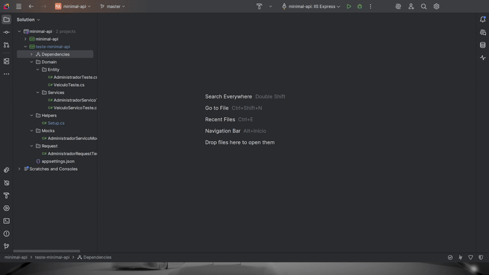
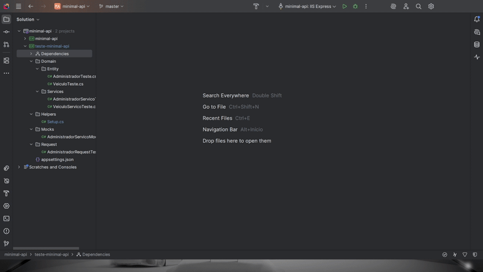
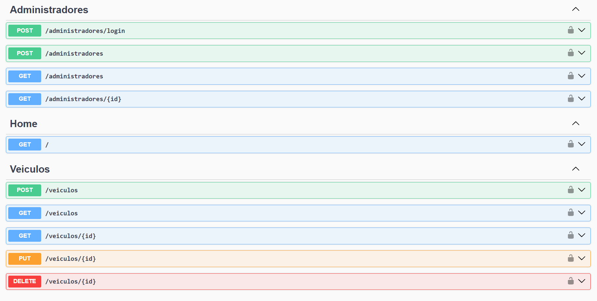

# 🚀 API .NET com Entity Framework + MySQL + Testes Unitários


## 📌 Sobre o Projeto

Este projeto foi desenvolvido durante um bootcamp de .NET, com foco em criar uma API RESTful estruturada com:

* .NET + C#
* Entity Framework Core para persistência
* MySQL como banco de dados
* Testes unitários com MSTEST/MVC.Testing
* JWT

🎯 O objetivo é demonstrar boas práticas de arquitetura, clean code e testes automatizados.
Este repositório também serve como portfólio para Backend .NET Developer.

---

## 🛠️ Tecnologias Utilizadas

* .NET 7 (C#)
* Entity Framework Core
* MySQL + Workbench
* MSTest / MVC.Testing
* Swagger para documentação
* Dependency Injection
* JWT

📂 Estrutura do Projeto
```
📦 minimal-api
 ┣ 📂 Dominio
    ┣ 📂 DTOs
    ┣ 📂 Entidades
    ┣ 📂 Enuns
    ┣ 📂 Interfaces
    ┣ 📂 ModelViews
    ┗ 📂 Servicos
 ┣ 📂 Infraestrutura
    ┗ 📂 Database
 ┣ appsettings.json   # Configurações (MySQL, JWT, etc.)
 ┣ Startup.cs
 ┗ Program.cs
```
---

## ⚙️ Como Rodar o Projeto
### 📋 Pré-requisitos

* .NET SDK
* MySQL + Workbench
* Qualquer IDE com suporte para .NET 7 (VSCODE com extensão C#, Visual Studio, Rider) 

### 🚀 Passos
#### Clone o repositório
```git
git clone https://github.com/Drvls/minimal-api-dotnet
```

#### Acesse a pasta
```terminal
cd minimal-api-dotnet
```

### 🔧 Configuração do Banco de Dados

Crie um banco de dados no MySQL Workbench (nome livre, exemplo: minimal_api).

```mysql
CREATE DATABASE minimal_api;
```

No arquivo appsettings.json, configure a conexão em "mysql":

```json
"ConnectionStrings": {
    "mysql": "Server=localhost;Database={BANCO DE DADOS};User Id={USER};Password={SENHA}"
  }
```

Aplique as migrations já criadas:

```terminal
dotnet ef database update
```

### ▶️ Executando a API
```terminal
dotnet run --project minimal-api
```

#### 📌 A API estará disponível em:

https://localhost:5001/swagger

---

## ✅ Funcionalidades

* CRUD completo de entidades
* Integração com banco MySQL via EF Core
* Validações de entrada
* Documentação via Swagger
* Testes Unitários
* Foram implementados testes para garantir confiabilidade das regras de negócio.

Rodar os testes:
```terminal
dotnet test
```


Se estiver usando outra IDE como Rider:




### 📸 Demonstração

Endpoints via Swagger:




### 📈 Aprendizados

* Estruturar uma API RESTful em .NET
* Usar Entity Framework Core para persistência
* Criar e rodar migrations no MySQL
* Implementar testes unitários para maior confiabilidade
* Documentar API com Swagger

---

🔥 Projeto desenvolvido como parte do Bootcamp .NET, mas estruturado para ser utilizado como portfólio profissional.